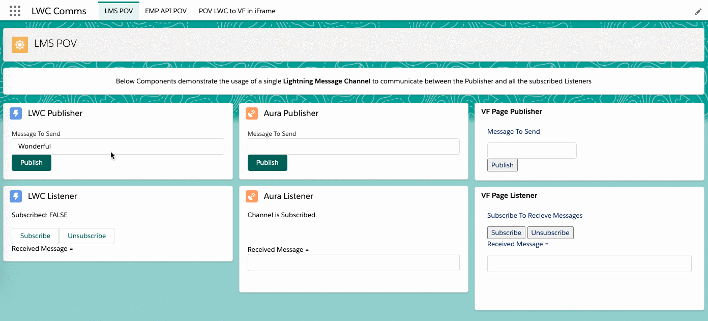
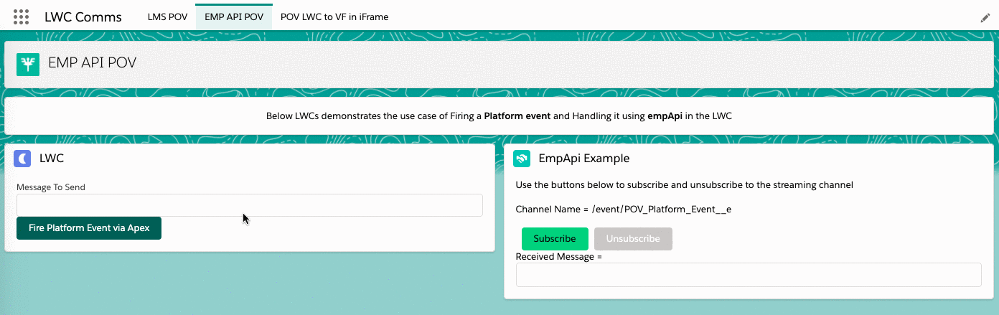
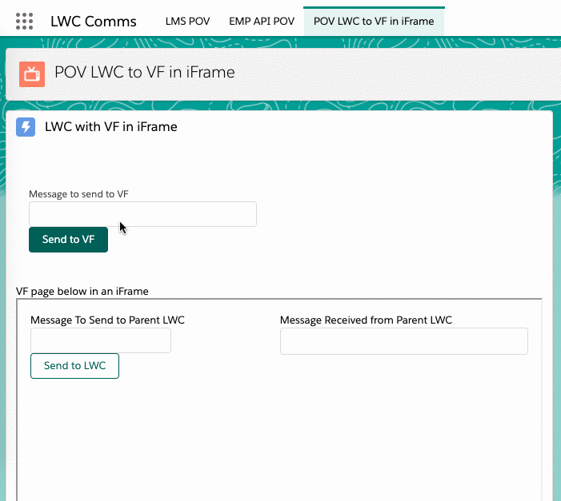

# LWC Communications
The App in this Repo demonstrates Communication scenarios  - 
* Using Lightning Message Service between LWC, Aura Component & VF page publishers and listeners
* Firing Platform Events between LWCs, and
* LWC containing VF in an iframe

---

## Scenarios

:zap: Using Lightning Message Service between LWC, Aura & VF :zap:



:sparkles: Firing Platform Events between LWCs :sparkles:



:star: LWC containing VF in an iframe :star:



---

## Installation / Deployment

Kindly follow below steps to deploy the contents of this repository in your Developer Edition Org or a Sandbox.

Prefer not to deploy this in a Trailhead Playground, as the Apex Class POV_Controller will need to be updated for the LWC-VF bidirectional code to work properly in a Trailhead Playground. Method getVFOrigin() in POV_Controller class has an elaborate Comment in there.


1. Clone this repository in your local machine:

    ```
    git clone https://github.com/sfwiseguys/LWCComms
    cd LWCComms
    ```

2. Authorize your org and provide it with an alias (example **mydevorg** in the command below):

    ```
    sfdx force:auth:web:login -s -a mydevorg
    ```

3. Run this command in a terminal to deploy this app in your Org

    ```
    sfdx force:source:deploy -p force-app
    ```

4. If your org isn't already open, open it now using this command:

    ```
    sfdx force:org:open -u mydevorg
    ```

Post Installation / Deployment, navigate to App Launcher, select the **LWC Comms** app to view the Three Tabs - 

* LMS POV - to see Lightning Message Service scenarios
* EMP API POV - to see LWCs listening to a Platform Event Channel
* POV LWC to VF in iFrame - LWC containing VF in an iframe, communicating to each other

---

## Authors

* **Waseem Ali Sabeel** - *Initial components* - [@WaseemAliSabeel](https://github.com/WaseemAliSabeel) :cowboy_hat_face:

---

## Support

Reach out at one of the following places!

- Website at [sfwiseguys.wordpress.com](https://sfwiseguys.wordpress.com) :tophat:
- Twitter at [@sfwiseguys](https://twitter.com/sfwiseguys)

---

## License

This project is licensed under the MIT License - see the [LICENSE.md](LICENSE.md) file for details

- **[MIT license](http://opensource.org/licenses/mit-license.php)**
- Copyright 2020 :copyright:  [sfwiseguys.wordpress.com](https://sfwiseguys.wordpress.com) :shipit:

## Acknowledgements

* :cloud: Salesforce Blogs on LMS & LWC Communication with Events
* :cloud: Salesforce Documentation and Examples
